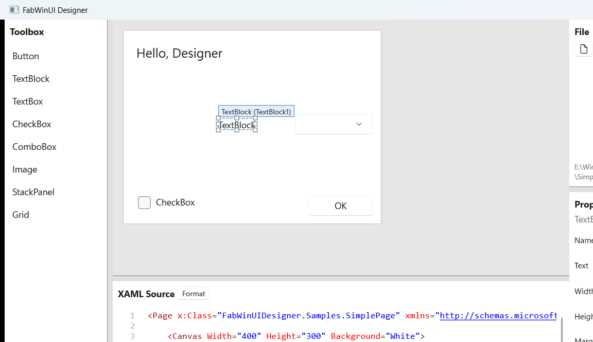

# FabWinUI Designer

A standalone visual form designer for WinUI 3 — a WinForms/WPF-designer-style tool (toolbox,
drag-to-place, property grid, live XAML source view) for a platform that doesn't ship one of
its own.



## Goal

WinUI 3 has no built-in visual designer comparable to the WinForms or WPF ones — Visual Studio's
XAML editor is text-first, with only a passive preview. This project is a "simple," standalone
app to place controls, edit their properties, and generate/round-trip real, hand-editable
`.xaml` files, in the spirit of those older designers.

## What it does

- Renders a real, live WinUI 3 tree on the design surface (via `XamlReader.Load`), not a drawn
  approximation.
- Round-trips genuine hand-editable `.xaml` files (`XDocument`-based) — no proprietary project
  format.
- Click-to-add toolbox, drag-to-move, 8-handle resize, and a reflection-driven property grid,
  all backed by an in-app undo/redo stack.
- A two-way-synced, syntax-highlighted XAML source view sits alongside the design surface:
  edit either one and the other follows, with inline error reporting for invalid XAML and a
  one-click reformat.

## What's supported

| Area | Support |
|---|---|
| Controls | `Button`, `TextBlock`, `TextBox`, `CheckBox`, `ComboBox`, `Image`, `StackPanel`, `Grid` |
| Layout | Canvas-based absolute positioning (`Canvas.Left`/`Top`, `Width`/`Height`) for v1 |
| Selection | Single-select, move, 8-handle resize |
| Properties | Reflection-driven property grid (curated per-type list, no design-time metadata exists on WinUI controls to discover this automatically) |
| XAML source | Editable, syntax-highlighted, two-way caret sync with the design surface, inline error reporting, Format Document |
| File I/O | Open/New/Save, folder-based file browser, Recent Files/Folders |
| Undo/Redo | Whole-document snapshots |
| Not yet | Multi-select, data binding UI, event-handler code generation (planned next — see below) |

## Requirements

- .NET 10 SDK
- Windows 10/11 SDK 10.0.19041.0 or later
- Visual Studio 2026 (recommended for day-to-day editing; not required for the CLI build below)

See [`docs/dev-setup.md`](docs/dev-setup.md) for full setup details, including the `.sln` vs
`.slnx` note and pinned package versions.

## Building and running

```
dotnet build FabWinUIDesigner.sln -p:Configuration=Debug -p:Platform=x64
dotnet build src/FabWinUIDesigner.App/FabWinUIDesigner.App.csproj -p:Platform=x64
./src/FabWinUIDesigner.App/bin/x64/Debug/net10.0-windows10.0.19041.0/FabWinUIDesigner.App.exe
```

```
dotnet test tests/FabWinUIDesigner.Document.Tests/FabWinUIDesigner.Document.Tests.csproj
dotnet test tests/FabWinUIDesigner.CodeGen.Tests/FabWinUIDesigner.CodeGen.Tests.csproj
```

## Project layout

- `src/FabWinUIDesigner.Document` — the XAML document model (`XDocument`-backed), no WinUI
  dependency.
- `src/FabWinUIDesigner.CodeGen` — Roslyn-based code generation, no WinUI dependency.
- `src/FabWinUIDesigner.Core` — WinUI-dependent designer logic (live-tree correlation, property
  grid schema, preview loading).
- `src/FabWinUIDesigner.App` — the WinUI 3 application shell.
- `tests/` — MSTest projects for the two pure-.NET layers.
- `samples/` — example `.xaml` files used by the app and its tests.

## Syntax highlighting

The XAML source view uses [TextControlBox-WinUI](https://github.com/FrozenAssassine/TextControlBox-WinUI)
(MIT) with a custom highlighting scheme matching Visual Studio's classic XML/XAML editor
palette.

## What's next

Event-handler code generation: wiring a XAML event (e.g. a `Button.Click`) to a Roslyn-generated
stub inserted into the paired `.xaml.cs` partial class.

## License

MIT — see [`LICENSE`](LICENSE).
